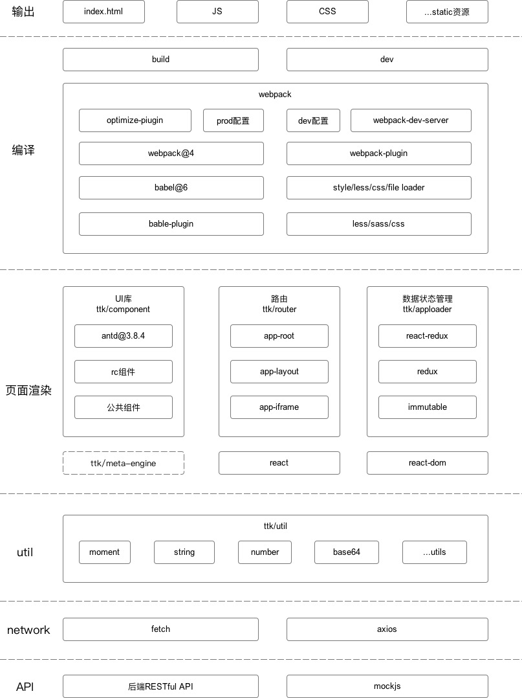

# `ttk2.x/react` 介绍

## 是什么？

`ttk2.x/react` 是基于 React、Redux、视图 JSON 化、插件化的企业级前端应用框架，专注前端的研发和积累、用新技术将复杂的商业产品的工程化。

<div class="pic-plus">

  
  <span>+</span>
  
  <span>+</span>
  

</div>

<style>
.pic-plus > * {
  display: inline-block !important; 
  vertical-align: middle; 
}
.pic-plus span {
  margin: 0 20px; 
  color: #aaa; 
  font-size: 30px; 
}
</style>

## 特性

### 1. 统一编译打包方案webpack

* 使用babel缓存、webpack持久化缓存，大幅提高编译速度
* 统一开发development、生产production模式配置文件，避免配置差异引起的开发、生产环境不一致
* 开发模式，业务模块、样式可单独打包，减少不必要的构建，最大程度地加快热更新速度

### 2. 丰富的UI组件ttk/component

* 基于antd 3.8.4版本，封装新增组件
* 分离业务组件，兼容已有项目
* 简化样式文件，组件目录和less文件统一调整为导出名称（首字母小写），根据该名称进行按需加载
* 其他样式问题、bug修复

 

### 3. 统一的开发套路

* 视图、业务、状态、样式、接口完全分离，结构非常清晰，方便快速入门

### 4. 开箱即用

* TTK 内置了路由、构建、部署、测试等，仅需安装脚手架即可上手开发。插件系统以及开发者 API，你可以根据业务需求搭建自己的前端工程体系。

### 5. 企业级

* 经公司内部 10+ 项目的验证，功能稳定、使用方便及开发效率方面都有不错的体验

### 6. 面向未来

* 在满足需求的同时，我们也不会停止对新技术的探索。比如 hook、dll 提速、Tpyescript、ssr、微服务、webpack@5、自动化化 external、bundler less 等等。

## 总体结构



## 现有能力

### 1. 页面加载引擎ttk/app-loader 赋予

  + 统一的状态管理
  + app注册
  + 页面路由

### 2. 页面解析引擎ttk/meta-engine 赋予

  + json元数据渲染成页面
  + 获取state 

``` js
  this.metaAction.gf('data.title')
```

  + 设置state 

``` js
    this.metaAction.sf('data.title', 'hello')
```

  > sf会进行state的内部比较，每次的sf都会重新渲染页面。如果涉及到批量sf时，统一使用sfs进行替换

  + 批设state 

``` js
  this.metaAction.sfs({
      'data.title': 'hello'
  })
```

  + 获取元数据 

``` js
  this.metaAction.gm("root.form.user", "style")
```

  + 设置元数据 

``` js
  this.metaAction.sm("root.form.user", "style", "color: #fff")
```

  + 获取上下文 

``` js
  this.metaAction.context.get("currentOrg")
```

  + 设置上下文 

``` js
  this.metaAction.context.set("currentOrg", {})
```

  + toast 全局提示 

  顶部剧中显示并自动消失，不打断用户操作的轻量级提示

``` js
  // type 可取值 open/success/error/info/warning/warn/loading
  const type = 'success'
  // message 不允许为空，可以是String、也可以是ReactNode
  const message = '成功'
  this.metaAction.toast(type, message)
```

  + modal 对话框

  当前页面打开一个浮层，承载相应的操作

``` js
  // type 可取值 show/success/error/info/warning
  const type = 'show'
  const options = {}
  this.metaAction.modal(type, options)
```

  > 参数options为object，具体属性请参照 [Antd3.x Modal API](https://3x.ant.design/components/modal-cn/#Modal.method())，其中content需用children替换，具体用法点[这里](./开发套路)

  + notification 通知提醒框
    - 较为复杂的通知内容。
    - 带有交互的通知，给出用户下一步的行动点。
    - 系统主动推送。

``` js
  // type 可取值 open/success/error/info/warning
  const type = 'open'
  const options = {}
  this.metaAction.notification(type, options)
```

  > 参数options为object，具体属性请参照 [Antd3.x Notification API](https://3x.ant.design/components/notification-cn/#API)，其中content需用children替换，具体用法点[这里](./开发套路)

## 兼容环境

* 现代浏览器和 IE9 及以上。

| </br>IE / Edge | </br>Firefox | </br>Chrome | </br>Safari | </br>Opera |
| --- | --- | --- | --- | --- |
| Edge, IE9及以上 | last 2 versions | last 2 versions | last 2 versions | last 2 versions |

对于 IE 系列浏览器，需要提供相应的 Polyfill 支持，建议使用 [@babel/preset-env](https://babeljs.io/docs/en/babel-preset-env) 来解决浏览器兼容问题。

## 版本

* 稳定版：[](https://www.npmjs.org/package/ttk-app-core)
* 2.x：[](https://www.npmjs.org/package/ttk-app-core@2.1.17)

## 仓库地址

<https://github.com/thethreekingdoms/ttk-app-core>

## 反馈

[New issue](https://github.com/thethreekingdoms/ttk-app-core/issues)

## 链接

* [目录结构](./目录结构)
* [环境准备](./环境准备)
* [常用Git命令](./常用Git命令)
* [开发规范](./开发规范)
* [公共工具类](./公共工具类)
* [公共组件](./公共组件)
* [门户赋能](./门户赋能)
* [开发套路](./开发套路)
* [常见问题](./常见问题)
* [@ttk/react 文档](/@ttk/react/)
